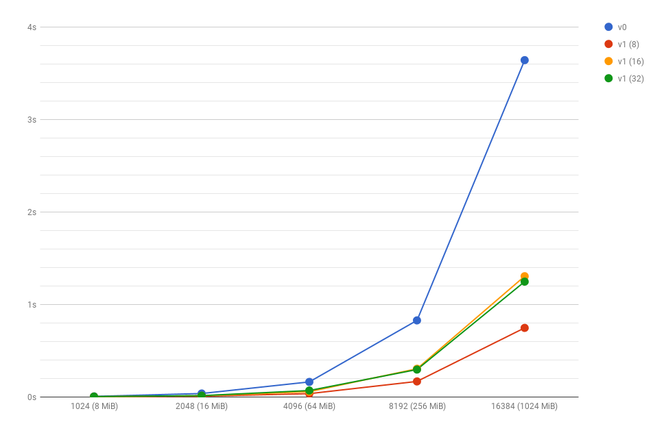
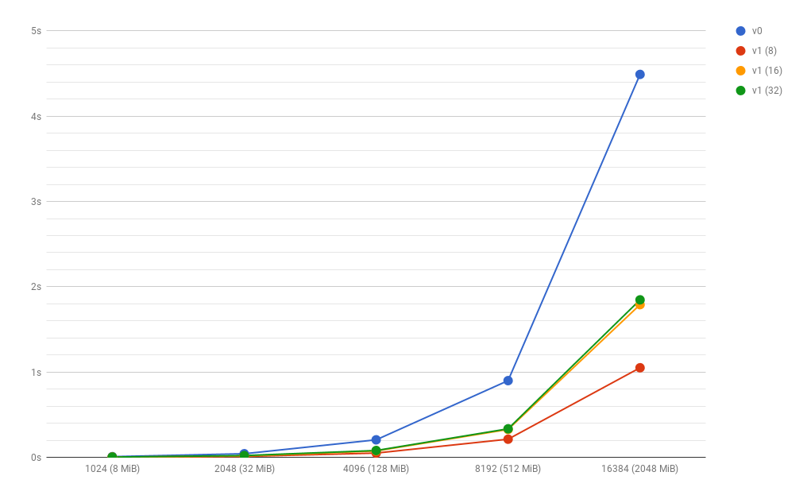

# Raport do zadań z pracowni #2

 - Autor: Oskar Sobczyk
 - Numer indeksu: 281822

Konfiguracja
---

Informacje o systemie:
 - Dystrybucja: Ubuntu 18.04 LTS
 - Jądro systemu: GNU/Linux 4.15.0
 - Kompilator: GCC 7.3.0
 - Procesor: Intel® Core™ i5-4590 CPU @ 3.30GHz
 - Liczba rdzeni: 4

Pamięć podręczna:
 * L1d: 32 KiB, 8-drożny (per rdzeń), rozmiar linii 64B
 * L2: 256 KiB, 8-drożny (per rdzeń), rozmiar linii 64B
 * L3: 6MiB, 12-drożny (współdzielony), rozmiar linii 64B

Pamięć TLB:
 * L1d: 4KiB strony, 4-drożny, 64 wpisy
 * L2: 4KiB strony, 6-drożny, 1536 wpisów

 Informacje uzyskane na podstawie programu `x86info`.

# Zadanie 1

int:
---
|n      | v0    | v1    | v2    | v3    |
|:---:  |:---:  |:---:  |:---:  |:---:  |
|512    | 0.195 | 0.083 | 0.673 | null  |
|1024   | 2.871 | 0.656 | 14.624| null  |
|2048   | 63.025| 5.342 | 140.456| null |

double:
--- 
|n      | v0    | v1    | v2    | v3    |
|:---:  |:---:  |:---:  |:---:  |:---:  |
|512    |0.190  |0.078  | 1.012 | null  |
|1024   |6.721  | 0.823 | 15.016| null  |
|2048   |75.610 |7.232  | 180.319|null|

# Zadnie 3

Rozwiązanie w wersji `v0` cechuje się niską lokalnością danych. Macierz ułożona jest w pamięci wiersz za wierszem. Dostęp do dowolnego elementu macierzy wymaga wczytania całego wiersza. Korzystając z funkcji `transpose1` aby stransponować jeden wiersz macirzy `src` potrzeba wczytania `n` wierszy macierzy `dst`. W zależności od rozmiaru pamięci cache ilość chybień może się zwiększać.

Roziązaniem jest transpozycja macierzy podzielonej na bloki w sposób przedstawiony na rysunką poniżej. Została ona zaimplementowana w funkcji `transpose2`. Wykorzystanie takiej moetody zwiększa lokalność danych. Program wiele razy odwołuje się do danych już wczytanych w pamięci cache.

int:
---

|n                  | v0        | v1 (8)    |v1 (16)    | v1 (32)   |
|:---:              |:---:      |:---:      |:---:      | :---:     |
|1024 (8 MiB)       | 0.00651   | 0.002537  |0.0035     |   0.0047  | 
|2048 (16 MiB)      | 0.03771   | 0.008665  |0.0137     |   0.0147  |
|4096 (64 MiB)      | 0.16307   | 0.036294  |0.0578     |   0.0701  |
|8192 (256 MiB)     | 0.82793   | 0.168385  |0.3052     |   0.2966  |
|16384 (1024 MiB)   | 3.639903  | 0.746810  |1.3051     |   1.2468  |

double:
---

|n                  | v0        | v1 (8)    |v1 (16)    | v1 (32)   |
|:---:              |:---:      |:---:      |:---:      | :---:     |
|1024 (8 MiB)       |0.0089     |0.0026     |0.0036     |0.0042     |
|2048 (32 MiB)      |0.0432     |0.0116     |0.0169     |0.0217     |
|4096 (128 MiB)     |0.2062     |0.0508     |0.0755     |0.0809     |
|8192 (512 MiB)     |0.9004     |0.2137     |0.3279     |0.3355     |
|16384 (2048 MiB)   |4.4905     |1.0510     |1.7912     |1.8474     |

# Zadanie 4

Funkcja `randomwalk1` składa się z 75 instrukcji maszynowych. Czas wykonania dla wywołania z parametrami `./randwalk -S 0xea3495cc76b34acc -n 7 -s 16 -t 14 -v 0` wynosi średnio 5.78 sekundy. 

Proces optymalizacji opierał się na spstrzeżenie że ciała instrukcji warunkowych mają za zadanie inkrementacje/dekrementacje zmiennych. Dzięki czemu można przetłumaczyć je na postać `<zmienan> -=/+= <wyrażenie porównania> & <wyrażenie porównania logiczny>...`. Taka optymalizacja pozwala na zastąpienie instrukcji skoków warunkowych instrukcjami `set`. Ciało funkcji `randomwalk2` po takiej optymalizacji ma 78 instrukcje. Natomiast ilość skoków warunkowych zmniejszyła się z 6 w `randomwalk1` do 2 w `randomwalk2`. Czas wykonania spadł o około 45% do 3,2s 

# Zadanie 5

Budowa kopca polega na rekurencyjnym wyszukiwaniu środków tablic i umieszczaniu ich w korzeniu drzewa w taki sposób że dla środkowego elementu `a_n/2` jego lewo poddrzewo to elementy tablicy `a_1,a_2...,a_n/2-1` a prawe poddrzewo to `a_n/2+1...a_n`