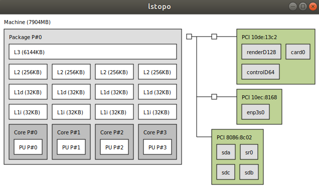
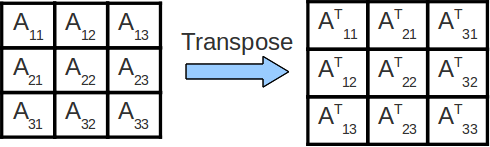

# Raport do zadań z pracowni #2

 ### Autor: Oskar Sobczyk
 ### Numer indeksu: 281822

Konfiguracja
---

Informacje o systemie:
 - Dystrybucja: Ubuntu 18.04 LTS
 - Jądro systemu: GNU/Linux 4.15.0
 - Kompilator: GCC 7.3.0
 - Procesor: Intel® Core™ i5-4590 CPU @ 3.30GHz
 - Liczba rdzeni: 4

Pamięć podręczna:
 * L1d: 32 KiB, 8-drożny (per rdzeń), rozmiar linii 64B
 * L2: 256 KiB, 8-drożny (per rdzeń), rozmiar linii 64B
 * L3: 6MiB, 12-drożny (współdzielony), rozmiar linii 64B

Pamięć TLB:
 * L1d: 4KiB strony, 4-drożny, 64 wpisy
 * L2: 4KiB strony, 6-drożny, 1536 wpisów

 


 Informacje uzyskane na podstawie programu `x86info` i `lstopo`.

# Zadanie 1

Rozbieżności w czasie wykonania poszczególnych wersji wynika z z ilości chybień w pamięci cache.
Można zaobserwować znaczną różnice w czasie wykonania wersji blokowej pomiędy blokami 16 a 32 dla wersji int oraz 8 i 16 dla double. Możemy z tego wywnioskować że w tym momencie blok przestaje się mieścić w pamięci cache L1. 


# Zadnie 3

Rozwiązanie w wersji `v0` cechuje się niską lokalnością danych. Macierz ułożona jest w pamięci wiersz za wierszem.
Dostęp do dowolnego elementu macierzy wymaga wczytania całego wiersza. Korzystając z funkcji `transpose1` 
aby stransponować jeden wiersz macirzy `src` potrzeba wczytania `n` wierszy macierzy `dst`.
W zależności od rozmiaru pamięci cache ilość chybień może się zwiększać.

Rozwiązaniem tego problemu jest podział macierzy na bloki. Następnie każdy taki blok jest transponowany i zapisywany w macierzy docelowej.
Została ona zaimplementowana w funkcji `transpose2`. Wykorzystanie takiej metody zwiększa lokalność danych.
Program wiele razy odwołuje się do danych już wczytanych w pamięci cache. Kozystając z programu valgrind mozna sprawdzić ze ilość chybień w pamięci zmalała z 12,5% do 4%. 




Zrzut z programu `valgrind --tool=cachegrind`

```

    ==9578== Command: ./transpose -n 4096 -v 0
    ==9578== 
    --9578-- warning: L3 cache found, using its data for the LL simulation.
    Generate matrix 4096 x 4096 (131072 KiB)
    Performing matrix transposition.
    Time elapsed: 0.771113 seconds.
    ==9578== 
    ==9578== I   refs:      352,594,643
    ==9578== I1  misses:          1,231
    ==9578== LLi misses:          1,218
    ==9578== I1  miss rate:        0.00%
    ==9578== LLi miss rate:        0.00%
    ==9578== 
    ==9578== D   refs:      184,613,926  (16,828,663 rd   + 167,785,263 wr)
    ==9578== D1  misses:     23,072,101  ( 2,099,909 rd   +  20,972,192 wr)
    ==9578== LLd misses:     23,071,494  ( 2,099,370 rd   +  20,972,124 wr)
    ==9578== D1  miss rate:        12.5% (      12.5%     +        12.5%  )
    ==9578== LLd miss rate:        12.5% (      12.5%     +        12.5%  )
    ==9578== 
    ==9578== LL refs:        23,073,332  ( 2,101,140 rd   +  20,972,192 wr)
    ==9578== LL misses:      23,072,712  ( 2,100,588 rd   +  20,972,124 wr)
    ==9578== LL miss rate:          4.3% (       0.6%     +        12.5%  )

```

```

    ==9584== Command: ./transpose -n 4096 -v 1
    ==9584== 
    --9584-- warning: L3 cache found, using its data for the LL simulation.
    Generate matrix 4096 x 4096 (131072 KiB)
    Performing matrix transposition.
    Time elapsed: 0.557296 seconds.
    ==9584== 
    ==9584== I   refs:      386,390,767
    ==9584== I1  misses:          1,236
    ==9584== LLi misses:          1,223
    ==9584== I1  miss rate:        0.00%
    ==9584== LLi miss rate:        0.00%
    ==9584== 
    ==9584== D   refs:      188,029,499  (20,242,173 rd   + 167,787,326 wr)
    ==9584== D1  misses:      8,637,667  ( 2,116,165 rd   +   6,521,502 wr)
    ==9584== LLd misses:      8,391,428  ( 2,099,370 rd   +   6,292,058 wr)
    ==9584== D1  miss rate:         4.6% (      10.5%     +         3.9%  )
    ==9584== LLd miss rate:         4.5% (      10.4%     +         3.8%  )
    ==9584== 
    ==9584== LL refs:         8,638,903  ( 2,117,401 rd   +   6,521,502 wr)
    ==9584== LL misses:       8,392,651  ( 2,100,593 rd   +   6,292,058 wr)
    ==9584== LL miss rate:          1.5% (       0.5%     +         3.8%  )

```
# Zadanie 4

Funkcja `randomwalk1` składa się z 75 instrukcji maszynowych. Czas wykonania dla wywołania z parametrami `./randwalk -S 0xea3495cc76b34acc -n 7 -s 16 -t 14 -v 0` wynosi średnio 5.78 sekundy. 

Proces optymalizacji opierał się na spstrzeżeniu że ciała instrukcji warunkowych mają za zadanie inkrementacje/dekrementacje zmiennych. Dzięki czemu można przetłumaczyć je na postać `<zmienan> -=/+= <wyrażenie porównania> & <wyrażenie porównania logiczny>...`. Taka optymalizacja pozwala na zastąpienie instrukcji skoków warunkowych instrukcjami `set`. Ciało funkcji `randomwalk2` po takiej optymalizacji ma 78 instrukcje. Natomiast ilość skoków warunkowych zmniejszyła się z 6 w `randomwalk1` do 2 w `randomwalk2`. Czas wykonania spadł o około 45% do 3,2s 

Porównując czasy wykonania dla różnych n (w zakresie od 3 do 16) przy tych samych parametrach `-s -t` można stwierdzić że różnice w czasie działania są na nizauważalnym poziomie i rozmiar tablicy nie ma wpływu na działanie programu.

# Zadanie 5
`v0 czas: 9.35`
`v1 czas: 2.89`

Budowa kopca polega na rekurencyjnym wyszukiwaniu środków tablic i umieszczaniu ich w korzeniu drzewa w taki sposób że dla środkowego elementu `a_n/2` jego lewo poddrzewo to elementy tablicy `a_1,a_2...,a_n/2-1` a prawe poddrzewo to `a_n/2+1...a_n`

Zmiana organizacji danych spowodowała przyśpieszenie przez zwiększenie lokalności danych. Po pierwsze dane na początku tablicy są gęścij ułożone (kolejne elementy są na miejscu `2*i+1` lub `2*1+2`) przez co na początku istnieje duże prawdopodobieństwo że kolejny element już jest wczytany do pamięci cache, prawdopodobnieństow spada wraz ze wzrostem `i`. Po drugie algorytm idzie cały czas w prawą strone tablicy co również zmniejsza prawdopodobnieństwo konieczności wczytania fragmentu tablicy do pamięci cache.

Zmiana kolejności instrukcji w `heap_search` ma niezauważalny wpływ na czas działania.